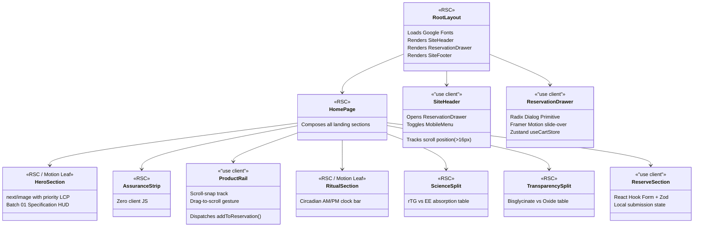
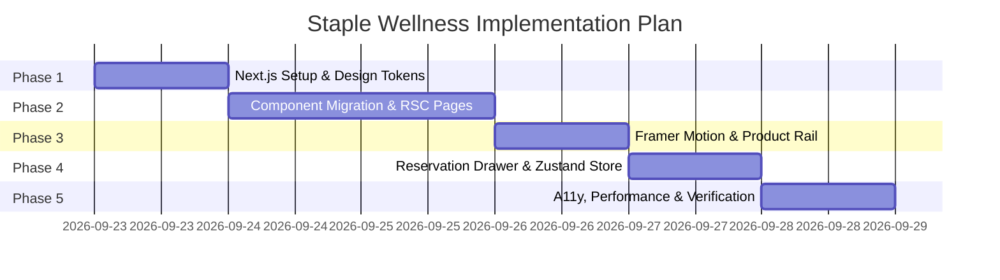

# Staple Wellness — Technical Architecture Document
**Target Stack:** Next.js 15+ (App Router), TypeScript 5+, Tailwind CSS v4, Framer Motion 12+  
**Design Reference:** `mock-design/index.html` (Exact layout, tokens, typography, and interactive behaviors)  
**Brand Identity:** Clinical Authority & Circadian Editorial Transparency (AM Lemon Yellow `#F6E77A` + PM Baby Pink `#FAD4D8` on Sandalwood Milk `#FAF8F1` / `#F5F5DC`)  
**Status:** Architecture Blueprint / Specification

---

## 1. Executive Summary & Objective

This document defines the production engineering architecture for transforming the high-fidelity pre-launch prototype in [`mock-design/index.html`](file:///c:/Users/hp/Documents/staple_wellness/mock-design/index.html) into an enterprise-grade, high-performance web application built with **Next.js 15+ (App Router)**, **TypeScript**, **Tailwind CSS v4**, and **Framer Motion**.

### Core Requirements
1. **Design Fidelity (Zero Regressions):** Replicate the exact visual hierarchy, spatial proportions, color calibration, and typography of `mock-design/index.html`.
2. **UI Refinements:**
   - Upgrade vanilla DOM interactions to declarative, spring-physics micro-interactions via Framer Motion.
   - Implement headless, accessible WAI-ARIA primitives (Radix UI) for drawers, menus, and tooltips.
   - Deliver sub-100ms INP (Interaction to Next Paint) and zero CLS (Cumulative Layout Shift) with `next/image` and `next/font`.
   - Maintain full SSR/hydration safety, WCAG 2.1 AA/AAA contrast ratios, and `prefers-reduced-motion` compliance.
3. **Architecture Boundaries:** Clear separation between React Server Components (RSC) for maximum SEO/performance and Client Components (`"use client"`) for rich interactive widgets.
4. **Mandatory Project Design Skills Adherence:** Any AI coding agent implementing, updating, or reviewing this application MUST actively invoke and adhere to the specialized design skills embedded directly in this workspace (`.agents/skills/awesome-claude-design`, `.commandcode/skills/ui-ux-pro-max`, `.commandcode/skills/design-system`, `.commandcode/skills/brand`, `.commandcode/skills/ui-styling`, and `.commandcode/skills/banner-design`).
5. **Strict Frontend-Only Scope:** For the current phase, the scope is **strictly a pure frontend design web application**. Do NOT add any backend servers, databases, external API endpoints, ORMs, CMS integrations, or auth systems. All states (reservation queue, item totals, and form submission confirmations) are handled entirely within the client-side UI and state layer.

---

## 2. Project Design Skills & Agent Execution Protocols

To prevent generic AI patterns ("AI slop") and guarantee that the implementation matches the museum-grade aesthetic of `mock-design/index.html` and `Doc/design.md`, any implementing agent **MUST** reference and apply the following local design skills installed in the repository:

### 2.1 Skill Inventory & Activation Matrix

| Skill | Location | Primary Role & When to Activate | Key Deliverables & Rules |
|---|---|---|---|
| **`awesome-claude-design`** | `.agents/skills/awesome-claude-design/` (also `/awesome-claude-design`) | Scaffolding layout, section compositions, and frontend styling. | • Enforces **Aesthetic Family #2: Warm Editorial & Clinical Transparency** (Claude / Ritual benchmark).<br>• Anti-Slop Rules: Bans floating irrelevant 3D shapes, generic card-inside-card patterns, and non-calibrated gradients.<br>• Grounded composition inspired by high-end packaging. |
| **`ui-ux-pro-max`** | `.commandcode/skills/ui-ux-pro-max/` | UI/UX quality control, accessibility verification, and micro-interactions. | • Priority 1: Contrast AAA (16.2:1 / 7.8:1) and AA (4.5:1), visible focus rings (`:focus-visible`), explicit ARIA attributes.<br>• Priority 2: Mobile touch targets ≥ 44×44px with ≥ 8px gaps.<br>• Priority 3: Zero CLS (&lt; 0.1) using explicit aspect-ratios and `next/image` layout space reservation.<br>• Priority 7: Context-aware motion timing (150–250ms spring physics) and `prefers-reduced-motion` compliance. |
| **`design-system`** | `.commandcode/skills/design-system/` | Token architecture and CSS variable generation. | • Enforces **Three-Layer Token Architecture**: *Primitive* (raw hex) → *Semantic* (intent aliases: `--color-lemon`, `--color-pink`, `--color-ink`) → *Component* (`--pcard-bg`, `--drawer-border`).<br>• Strict ban on hardcoded hex colors in React components. |
| **`brand`** | `.commandcode/skills/brand/` | Brand voice, clinical tone, and copy integrity. | • Eliminates hyperbolic claims ("glowing skin", "miracle cure") in favor of biological precision: elemental yields, bio-availability, and circadian rhythm.<br>• Protects Surya (Solar AM Lemon) and Chandra (Lunar PM Pink) thematic balance. |
| **`ui-styling`** | `.commandcode/skills/ui-styling/` | Component state machines and responsive layouts. | • Full state definition for interactive controls: Default, Hover, Focus-Visible, Active, Disabled, Loading.<br>• Clean single-column collapse under 768px with zero horizontal scroll. |
| **`banner-design`** | `.commandcode/skills/banner-design/` | Hero section composition and visual impact. | • High-impact photography framing where printed bottle labels remain sharp and legible.<br>• Precise ambient scrim overlay preserving readability of dark typography on image backgrounds. |

### 2.2 Agent Operating Rules for Design Work

When implementing or refining any UI component:
1. **Never Invent Ad-Hoc Styling:** Do not generate random Tailwind arbitrary classes (`bg-[#123456]`, `p-[17px]`). Always pull from the calibrated tokens established in `DESIGN.md` and mapped in `globals.css`.
2. **Consult `ui-ux-pro-max` Search Script Before Building:** For specific component patterns, the agent should run the local search tool:
   ```bash
   python ".commandcode/skills/ui-ux-pro-max/scripts/search.py" "<query>" --domain <domain>
   ```
   *(e.g., query `--domain ux` for focus states, touch targets, and accessible error validation).*
3. **Verify Token Layering:** Use semantic tokens in CSS rules rather than raw hex values, adhering to `.commandcode/skills/design-system/references/token-architecture.md`.
4. **Enforce Anti-Slop Standards:** Run the pre-flight checks from `awesome-claude-design` to eliminate AI clichés before presenting completed components.

---

## 3. Analysis of Prototype (`mock-design/index.html`)

The prototype contains 2,194 lines of handcrafted HTML5, semantic CSS variables, and zero-dependency ES5 JavaScript.

### 2.1 Structural Breakdown & UI Modules

```mermaid
graph TD
    A[Root Page: mock-design/index.html] --> B[Header & Navigation]
    A --> C[Hero Section: Full-Bleed & Specs]
    A --> D[Assurance Banner: Batch 01 Assay]
    A --> E[Products: Scroll-Snap Rail]
    A --> F[Ritual: Circadian AM/PM Clock]
    A --> G[Science Split: Omega-3 rTG Matrix]
    A --> H[Transparency Split: Magnesium Chelate Matrix]
    A --> I[Traceability: 3-Step Lot Verification]
    A --> J[Standards: Asymmetric Commitments Grid]
    A --> K[Range Essentials: Quick-Look Grid]
    A --> L[Reserve Batch 01: Interactive Form]
    A --> M[Site Footer & Legal Disclaimers]
    A --> N[Slide-Over Reservation Drawer & Scrim]

    B --> B1[Sticky Scrolled Condenser]
    B --> B2[Formulations Mega Menu]
    B --> B3[Cart Counter & Drawer Trigger]
    B --> B4[Mobile Drawer & Hamburger]

    E --> E1[AM Card: Lemon Wash]
    E --> E2[PM Card: Pink Wash]
    E --> E3[Bundle Card: Save 350]
    E --> E4[Twin Packs: 60 Servings]
    E --> E5[Drag-to-Scroll + Arrow Controls]

    N --> N1[Dynamic Line Items]
    N --> N2[Live Subtotal Calculation]
    N --> N3[Automated Bundle Upsell Trigger]
    N --> N4[Focus Trap & Escape Handler]
```



### 2.2 Color Calibration & Circadian Token Mapping

| Token Name | Hex Code | Visual Role | Prototype Class / CSS Var |
|---|---|---|---|
| **Canvas** | `#FAF8F1` / `#F5F5DC` | Primary unbleached sandalwood parchment base | `--bg-canvas` / `body` |
| **Surface** | `#FFFFFF` | Card backgrounds, laboratory clean elevation | `--bg-surface` / `.pcard`, `.std` |
| **Subtle** | `#F4EFE6` | Soft limestone tint for secondary modules | `--bg-subtle` |
| **Mist** | `#EFE9DE` | Muted framing & card accents | `--bg-mist` |
| **Ink Primary** | `#1D1D1B` | High-contrast editorial titles, borders, primary buttons | `--text-primary`, `--border-focus` |
| **Ink Secondary** | `#57534E` | Herbal slate body copy and explanatory text | `--text-secondary` |
| **Ink Tertiary** | `#8A857D` | Monospace batch codes, lot identifiers, captions | `--text-tertiary` |
| **Lemon Yellow (AM)** | `#F6E77A` | Solar daytime accent, rTG Omega-3 pill tags | `--accent-lemon` |
| **Lemon Wash** | `#FEF9C3` | Ambient morning card background | `--accent-lemon-wash` |
| **Baby Pink (PM)** | `#FAD4D8` | Nocturnal calm accent, Night Magnesium tags | `--accent-pink` |
| **Baby Pink Wash** | `#FCE4E8` | Ambient evening card background | `--accent-pink-wash` |
| **Clinical Sage** | `#3B6E52` | Third-party assay stamps, heavy-metal non-detect | `--accent-sage` |
| **Hairline Border** | `rgba(29, 29, 27, 0.10)` | Tactile dividers and card perimeter lines | `--border` |

### 2.3 Typographic Foundation
- **Display / Editorial Headings:** `Plus Jakarta Sans` / `Inter` (`font-display`, weight: 400–600, tight tracking `-0.025em`)
- **Body & Interface:** `Plus Jakarta Sans` / `Inter` with system fallbacks (`font-body`, line-height: 1.55)
- **Clinical Specifications & Lot Codes:** `JetBrains Mono` (`font-mono`, all-caps, tracking: `0.06em` to `0.14em`)

---

## 3. Technology Stack & Architectural Decisions

| Layer | Selected Technology | Version | Rationale & Advantage over Prototype |
|---|---|---|---|
| **Meta-Framework** | Next.js (App Router) | `15.x` | Server-First architecture, Turbopack support, automatic code-splitting, native SEO metadata, and zero-JS static payload for purely presentation sections. |
| **Language** | TypeScript | `5.8+` | Strict type safety for pricing models, SKU specifications, batch assay data, and form payloads. |
| **Styling** | Tailwind CSS v4 | `4.x` | Native `@theme` engine, zero-runtime footprint, CSS variable integration, utility consistency, and fluid typography. |
| **Motion & Physics** | Framer Motion | `12.x` | Fluid spring physics for the drawer, layout animations for bundle swaps, declarative scroll-reveal viewports, and reduced-motion enforcement. |
| **Headless UI Primitives**| Radix UI / `@radix-ui` | Latest | Accessible dialog, portal, focus trap, and keyboard navigation for the Reservation Drawer and Mega Menu. |
| **State Management** | Zustand (with persist) | `5.x` | Lightweight (1.2kB), decoupled from React tree, automatic `localStorage` synchronization for user reservations. |
| **Form Management** | React Hook Form + Zod | `7.x / 3.x`| Type-safe reservation form validation (email format, phone sanitization) without extraneous re-renders. |
| **Icons** | Lucide React | Latest | Clean, consistent SVG icons (`Clock`, `ShoppingBag`, `ArrowRight`, `Check`, `ChevronDown`, `Menu`, `X`). |

---

## 4. System Architecture & Directory Blueprint

```
staple-wellness/
├── public/
│   ├── assets/                      # High-res photography & cutouts from mock-design/assets/
│   │   ├── logo-mark.png
│   │   ├── logo-mark-light.png
│   │   ├── product-hero.png
│   │   ├── product-omega3.png
│   │   ├── product-magnesium.png
│   │   ├── product-duo.png
│   │   └── ...
│   ├── favicon.svg
│   └── robots.txt
├── src/
│   ├── app/
│   │   ├── layout.tsx               # Root layout: Fonts, metadata, toast & drawer providers
│   │   ├── page.tsx                 # Main Storefront Page (RSC page composing client/server sections)
│   │   └── globals.css              # Tailwind v4 @theme, color variables, typography rules
│   ├── components/
│   │   ├── layout/
│   │   │   ├── site-header.tsx      # Sticky condensing header & mega menu (Client)
│   │   │   ├── site-footer.tsx      # Static legal, licensing, and sitemap footer (Server)
│   │   │   └── mobile-nav.tsx       # Accessible mobile hamburger drawer (Client)
│   │   ├── sections/
│   │   │   ├── hero-section.tsx     # Full-bleed hero banner & Batch 01 badge (Server/Motion)
│   │   │   ├── assurance-strip.tsx  # Assay specifications grid (Server)
│   │   │   ├── product-rail.tsx     # Scroll-snap & drag-to-scroll SKU carousel (Client)
│   │   │   ├── ritual-section.tsx   # Circadian AM/PM split & 24h clock track (Server/Motion)
│   │   │   ├── science-split.tsx    # Omega-3 rTG biochemical absorption matrix (Server)
│   │   │   ├── transparency-split.tsx # Magnesium Bisglycinate purity matrix (Server)
│   │   │   ├── verify-section.tsx   # 3-step lot verification & COA lookup (Server)
│   │   │   ├── standards-grid.tsx   # Asymmetric 3-commitments bento (Server)
│   │   │   ├── range-essentials.tsx # Quick-add formulation tiles (Server/Client)
│   │   │   └── reserve-section.tsx  # Batch 01 reservation form & success card (Client)
│   │   ├── drawer/
│   │   │   ├── reservation-drawer.tsx # Radix Dialog / Framer Motion slide-over sheet (Client)
│   │   │   ├── drawer-line-item.tsx   # SKU item row with quantity toggles (Client)
│   │   │   └── bundle-upsell.tsx      # "Complete the rhythm" dynamic upsell banner (Client)
│   │   └── ui/                      # Reusable atom components
│   │       ├── button.tsx           # Button primitives (.btn--dark, .btn--ghost, .btn--lemon)
│   │       ├── badge.tsx            # Circadian tags (AM, PM, Sage, Save ₹350)
│   │       ├── chip.tsx             # Specification chips (.chip, .chip--sage)
│   │       └── scroll-reveal.tsx    # Declarative viewport reveal wrapper
│   ├── config/
│   │   ├── products.ts              # SKU records, prices, servings, active yields, images
│   │   ├── standards.ts             # Clinical testing standards & commitments data
│   │   └── site.ts                  # Brand metadata, SEO defaults, FSSAI licence #
│   ├── hooks/
│   │   ├── use-cart.ts              # Zustand store for reservation state
│   │   ├── use-scroll-state.ts      # Header scroll condenser threshold hook
│   │   └── use-reduced-motion.ts    # Accessibility hook wrapping window.matchMedia
│   ├── lib/
│   │   ├── utils.ts                 # cn() merge utility (clsx + tailwind-merge)
│   │   └── formatters.ts            # Indian Currency formatting (₹1,850 via toLocaleString)
│   └── types/
│       ├── product.ts               # ProductSKU, BundleType, CircadianTiming types
│       └── reservation.ts           # ReservationPayload, LotVerification types
├── tsconfig.json
├── package.json
└── next.config.ts
```

---

## 4. Component Hierarchy & Server/Client Boundary Architecture

Next.js App Router performance depends on isolating interactivity to the leaf nodes. Content-heavy sections remain React Server Components (RSC) to minimize JavaScript bundle size.



### Boundary Rationale
- **`HeroSection`**, **`AssuranceStrip`**, **`ScienceSplit`**, **`TransparencySplit`**, **`VerifySection`**, **`StandardsGrid`**:  
  Rendered on the server as pure static HTML. Visual reveals are handled either via lightweight CSS `@keyframes` or isolated client-side `<ScrollReveal>` wrappers that do not contaminate the server tree.
- **`ProductRail`**:  
  Must be `"use client"` because it handles pointer-drag physics, scroll arrows (`rail.scrollBy`), and direct `"Reserve this"` button clicks that mutate cart state.
- **`ReservationDrawer`**:  
  Must be `"use client"` because it maintains an interactive queue, executes live pricing arithmetic, handles keyboard trap / backdrop dismissal, and triggers smart bundle upsells.

---

## 5. Domain Data Models & Product Catalog

The product catalog extracted from `mock-design/index.html` and `Doc/PRD.md` is codified into strict TypeScript definitions:

### 5.1 Product Types (`src/types/product.ts`)

```typescript
export type CircadianWindow = 'AM' | 'PM' | 'ALL_DAY';

export interface ProductSKU {
  id: string;
  name: string;
  slug: string;
  circadianWindow: CircadianWindow;
  subtitle: string;
  routineTiming: string;
  activeYield: string;
  price: number;
  originalPrice?: number;
  servings: number;
  badge?: string;
  chips: { label: string; variant?: 'default' | 'sage' }[];
  image: string;
  secondaryImage?: string;
  description: string;
  lotCodeReserved: string;
  specs: { label: string; value: string }[];
}
```

### 5.2 Product Catalog Config (`src/config/products.ts`)

```typescript
import { ProductSKU } from '@/types/product';

export const PRODUCTS: ProductSKU[] = [
  {
    id: 'stp-omega3-30',
    name: 'Daily Omega-3',
    slug: 'omega-3',
    circadianWindow: 'AM',
    subtitle: 'Heart · Brain · Joints',
    routineTiming: '08:00 · Take with breakfast',
    activeYield: '1,000mg active EPA+DHA · rTG form',
    price: 1850,
    servings: 30,
    badge: 'AM',
    chips: [
      { label: 'rTG form' },
      { label: '550 EPA / 450 DHA' },
      { label: '30 servings' },
    ],
    image: '/assets/product-omega3.png',
    lotCodeReserved: 'LOT-STP-2601-A',
    description: 'Wild Peruvian anchovy oil in re-esterified triglyceride form for 3.4× superior bio-availability.',
    specs: [
      { label: 'Active EPA', value: '550 mg / serving' },
      { label: 'Active DHA', value: '450 mg / serving' },
      { label: 'Total active Omega-3', value: '1,000 mg (≥90% purity)' },
      { label: 'Triglyceride form', value: 'rTG (not EE)' },
      { label: 'Sourcing', value: 'Wild Peruvian anchovy' },
    ],
  },
  {
    id: 'stp-magnesium-30',
    name: 'Night Magnesium+',
    slug: 'magnesium',
    circadianWindow: 'PM',
    subtitle: 'Sleep · Restore · Recharge',
    routineTiming: '22:30 · Take 45 min before sleep',
    activeYield: '300mg elemental Mg · 100% bisglycinate chelate',
    price: 1450,
    servings: 30,
    badge: 'PM',
    chips: [
      { label: 'Bisglycinate' },
      { label: '0mg oxide' },
      { label: '30 servings' },
    ],
    image: '/assets/product-magnesium.png',
    lotCodeReserved: 'LOT-STP-2602-B',
    description: '100% chelated Magnesium Bisglycinate that crosses intestinal walls intact with zero digestive upset.',
    specs: [
      { label: 'Elemental Magnesium', value: '300 mg / serving' },
      { label: 'Form', value: '100% bisglycinate chelate' },
      { label: 'Oxide fillers', value: '0 mg' },
      { label: 'Heavy metals', value: '< 0.001 ppm Pb · Cd · Hg' },
      { label: 'Third-party COA', value: 'Published by lot code' },
    ],
  },
  {
    id: 'stp-bundle-ampm',
    name: 'The AM/PM Daily System',
    slug: 'am-pm-system',
    circadianWindow: 'ALL_DAY',
    subtitle: 'Bundle · Both SKUs',
    routineTiming: 'Full 24-Hour Circadian Protocol',
    activeYield: 'Complete AM Focus & PM Recovery',
    price: 2950,
    originalPrice: 3300,
    servings: 30,
    badge: 'Save ₹350',
    chips: [
      { label: 'Full 24h routine', variant: 'sage' },
      { label: 'Both lot codes' },
    ],
    image: '/assets/product-duo.png',
    lotCodeReserved: 'LOT-STP-2601-A & 2602-B',
    description: 'The complete circadian protocol: Daily Omega-3 at sunrise, Night Magnesium+ before sleep.',
    specs: [
      { label: 'Morning Protocol', value: '1,000mg active rTG Omega-3' },
      { label: 'Evening Protocol', value: '300mg chelated Magnesium' },
      { label: 'Total Assayed Servings', value: '30 AM + 30 PM' },
      { label: 'Combined Savings', value: '₹350 against individual SKUs' },
    ],
  },
  {
    id: 'stp-omega3-twin',
    name: 'Daily Omega-3 · Twin',
    slug: 'omega-3-twin',
    circadianWindow: 'AM',
    subtitle: 'Twin Pack: 2-month supply',
    routineTiming: '08:00 · Morning routine',
    activeYield: '2,000mg total monthly yield',
    price: 3330,
    originalPrice: 3700,
    servings: 60,
    badge: 'AM',
    chips: [
      { label: '60 servings' },
      { label: 'Save ₹370', variant: 'sage' },
    ],
    image: '/assets/product-omega3.png',
    lotCodeReserved: 'LOT-STP-2601-A',
    description: 'Double volume of Daily Omega-3 for sustained cardiovascular and cognitive support.',
    specs: [
      { label: 'Supply Duration', value: '60 days (2 bottles)' },
      { label: 'Active EPA+DHA', value: '1,000mg / serving' },
      { label: 'Unit Savings', value: '10% bundled discount' },
    ],
  },
  {
    id: 'stp-magnesium-twin',
    name: 'Night Magnesium+ · Twin',
    slug: 'magnesium-twin',
    circadianWindow: 'PM',
    subtitle: 'Twin Pack: 2-month supply',
    routineTiming: '22:30 · Night routine',
    activeYield: '600mg total monthly yield',
    price: 2610,
    originalPrice: 2900,
    servings: 60,
    badge: 'PM',
    chips: [
      { label: '60 servings' },
      { label: 'Save ₹290', variant: 'sage' },
    ],
    image: '/assets/product-magnesium.png',
    lotCodeReserved: 'LOT-STP-2602-B',
    description: 'Double volume of Night Magnesium+ for long-term sleep architecture enhancement.',
    specs: [
      { label: 'Supply Duration', value: '60 days (2 bottles)' },
      { label: 'Elemental Yield', value: '300mg / serving' },
      { label: 'Unit Savings', value: '10% bundled discount' },
    ],
  },
];
```

---

## 6. State Architecture & Smart Reservation Engine

The reservation drawer in `mock-design/index.html` operates a unique pre-launch reservation flow with intelligent bundle detection. This is modeled using Zustand with `immer` and `persist`.

### 6.1 State Store Specification (`src/hooks/use-cart.ts`)

```typescript
import { create } from 'zustand';
import { persist } from 'zustand/middleware';

export interface CartLine {
  id: string;
  name: string;
  price: number;
  image: string;
  qty: number;
}

interface CartState {
  isOpen: boolean;
  items: CartLine[];
  openDrawer: () => void;
  closeDrawer: () => void;
  addItem: (product: { name: string; price: number; image: string; id: string }) => void;
  removeItem: (index: number) => void;
  updateQuantity: (index: number, delta: number) => void;
  swapForBundle: () => void;
  clearCart: () => void;
  totalCount: () => number;
  subtotal: () => number;
  getUpsellEligibility: () => { eligible: boolean; missingSKU?: string; savings: number };
}

const BUNDLE_NAME = 'The AM/PM Daily System';
const BUNDLE_PRICE = 2950;
const BUNDLE_WAS = 3300;
const SINGLES = ['Daily Omega-3', 'Night Magnesium+'];

export const useCartStore = create<CartState>()(
  persist(
    (set, get) => ({
      isOpen: false,
      items: [],

      openDrawer: () => set({ isOpen: true }),
      closeDrawer: () => set({ isOpen: false }),

      addItem: (product) => {
        const items = [...get().items];
        const existing = items.find((i) => i.name === product.name);
        if (existing) {
          existing.qty += 1;
        } else {
          items.push({ ...product, qty: 1 });
        }
        set({ items, isOpen: true });
      },

      removeItem: (index) => {
        const items = get().items.filter((_, i) => i !== index);
        set({ items });
      },

      updateQuantity: (index, delta) => {
        const items = [...get().items];
        items[index].qty += delta;
        if (items[index].qty <= 0) {
          items.splice(index, 1);
        }
        set({ items });
      },

      swapForBundle: () => {
        set({
          items: [
            {
              id: 'stp-bundle-ampm',
              name: BUNDLE_NAME,
              price: BUNDLE_PRICE,
              image: '/assets/product-duo.png',
              qty: 1,
            },
          ],
        });
      },

      clearCart: () => set({ items: [] }),

      totalCount: () => get().items.reduce((sum, item) => sum + item.qty, 0),
      subtotal: () => get().items.reduce((sum, item) => sum + item.price * item.qty, 0),

      getUpsellEligibility: () => {
        const items = get().items;
        const hasBundle = items.some((i) => i.name === BUNDLE_NAME);
        if (hasBundle) return { eligible: false, savings: 0 };

        const heldSingles = items
          .filter((i) => SINGLES.includes(i.name))
          .map((i) => i.name);

        if (heldSingles.length === 1) {
          const missing = SINGLES.find((name) => name !== heldSingles[0]);
          return {
            eligible: true,
            missingSKU: missing,
            savings: BUNDLE_WAS - BUNDLE_PRICE,
          };
        }

        return { eligible: false, savings: 0 };
      },
    }),
    {
      name: 'staple_reservation_storage',
      partialize: (state) => ({ items: state.items }),
    }
  )
);
```

---

## 7. Design System & Tailwind CSS v4 Configuration

Tailwind CSS v4 replaces `tailwind.config.js` with direct CSS `@theme` rules. The exact tokens from `mock-design/index.html` are mapped into `src/app/globals.css`:

```css
@import "tailwindcss";

@theme {
  /* Surface & Canvas Tokens */
  --color-canvas: #F5F5DC;
  --color-canvas-ivory: #FAF8F1;
  --color-surface: #FFFFFF;
  --color-subtle: #F4EFE6;
  --color-mist: #EFE9DE;

  /* Editorial Ink Tokens */
  --color-ink: #1D1D1B;
  --color-ink-soft: #57534E;
  --color-ink-muted: #8A857D;

  /* Circadian Accent Tokens */
  --color-lemon: #F6E77A;
  --color-lemon-hover: #EED956;
  --color-lemon-wash: #FEF9C3;
  --color-pink: #FAD4D8;
  --color-pink-hover: #F7BDC4;
  --color-pink-wash: #FCE4E8;
  --color-sage: #3B6E52;

  /* Border Utilities */
  --color-border-hairline: rgba(29, 29, 27, 0.10);
  --color-border-mid: rgba(29, 29, 27, 0.18);

  /* Font Families */
  --font-display: var(--font-jakarta), var(--font-inter), sans-serif;
  --font-body: var(--font-jakarta), var(--font-inter), sans-serif;
  --font-mono: var(--font-mono), monospace;

  /* Radii */
  --radius-card: 16px;
  --radius-pill: 100px;
}

/* Base resets & typography */
@layer base {
  body {
    background-color: var(--color-canvas);
    color: var(--color-ink);
    font-family: var(--font-body);
    font-size: 16px;
    line-height: 1.55;
    -webkit-font-smoothing: antialiased;
  }

  [id] {
    scroll-margin-top: 96px;
  }

  :focus-visible {
    outline: 2px solid var(--color-ink);
    outline-offset: 3px;
    border-radius: 4px;
  }
}
```

---

## 8. Framer Motion Orchestration & UI Refinements

The prototype used a simple `IntersectionObserver` with CSS transitions. With Framer Motion 12+, we elevate the UI to luxury-tier fluid interactions without altering visual designs.

### 8.1 Unified Animation Variants

```typescript
// src/lib/motion.ts
import { Variants } from 'framer-motion';

export const springPhysics = {
  type: 'spring',
  damping: 24,
  stiffness: 260,
  mass: 0.8,
};

export const fadeInUp: Variants = {
  hidden: { opacity: 0, y: 24 },
  visible: {
    opacity: 1,
    y: 0,
    transition: {
      duration: 0.6,
      ease: [0.25, 0.1, 0.25, 1.0],
    },
  },
};

export const staggerContainer: Variants = {
  hidden: { opacity: 0 },
  visible: {
    opacity: 1,
    transition: {
      staggerChildren: 0.12,
      delayChildren: 0.08,
    },
  },
};

export const drawerSlide: Variants = {
  closed: { x: '100%', opacity: 0.6 },
  open: {
    x: 0,
    opacity: 1,
    transition: { type: 'spring', damping: 28, stiffness: 280 },
  },
};

export const scrimFade: Variants = {
  closed: { opacity: 0, pointerEvents: 'none' },
  open: { opacity: 1, pointerEvents: 'auto', transition: { duration: 0.25 } },
};
```

### 8.2 UI Refinements Implemented over Prototype

1. **Header Condensing on Scroll:**
   - Instead of a blunt DOM class toggle, a smooth layout transition reduces padding from `20px` to `12px` and introduces an ambient shadow (`0 8px 30px rgba(29,29,27,0.06)`) with `backdrop-filter: blur(12px)`.
2. **Product Rail Gesture Mechanics:**
   - Upgrades raw pointer event listeners to Framer Motion's `drag="x"` with spring constraints and wheel-scroll interoperability.
3. **Reservation Drawer Micro-Physics:**
   - Dynamic height transitions when items are added/removed.
   - Animated swap button with an encouraging bounce when upgrading to "The AM/PM Daily System".
4. **Accessible Keyboard Navigation:**
   - Full focus trapping via Radix Dialog when the drawer is open.
   - Screen-reader announcement (`aria-live="polite"`) when reservation count or subtotal updates.

---

## 9. Performance, Asset & SEO Strategy

### 9.1 Asset Pipeline & `next/image` Optimization
All photography files from `mock-design/assets/` will be migrated to Next.js image loading:
- **`product-hero.png`**: Loaded with `priority={true}` in the Hero component to satisfy Largest Contentful Paint (LCP < 1.2s). Preloaded with `fetchPriority="high"`.
- **Product Cutouts (`product-omega3.png`, `product-magnesium.png`, `product-duo.png`)**: Encoded in WebP with explicit width/height to eliminate Cumulative Layout Shift (CLS = 0).

### 9.2 Next.js Font Architecture
```typescript
// src/app/layout.tsx
import { Plus_Jakarta_Sans, Inter, JetBrains_Mono } from 'next/font/google';

const jakarta = Plus_Jakarta_Sans({
  subsets: ['latin'],
  variable: '--font-jakarta',
  display: 'swap',
  weight: ['400', '500', '600', '700'],
});

const inter = Inter({
  subsets: ['latin'],
  variable: '--font-inter',
  display: 'swap',
  weight: ['400', '500', '600'],
});

const mono = JetBrains_Mono({
  subsets: ['latin'],
  variable: '--font-mono',
  display: 'swap',
  weight: ['400', '500'],
});
```

### 9.3 Structured Data & SEO Architecture
Rich JSON-LD injected in `src/app/page.tsx`:
- `Product` schema for Daily Omega-3, Night Magnesium+, and the AM/PM Daily System.
- `Organization` schema specifying FSSAI license (`#10023043000892`) and ISO 22000 / GMP lab certifications.
- OpenGraph & Twitter Card metadata targeting premium Indian wellness seekers.

---

## 10. Step-by-Step Implementation Roadmap

When you are ready to implement the website, execution will follow these five sequential phases:



1. **Phase 1: Environment & Token Foundation**
   - *Design Skills Applied:* `design-system` (`.commandcode/skills/design-system/`) & `ui-styling` (`.commandcode/skills/ui-styling/`).
   - Initialize Next.js 15+ with TypeScript and Tailwind CSS v4.
   - Implement the **Three-Layer Token Architecture** (Primitive → Semantic → Component) in `src/app/globals.css` using Tailwind v4 `@theme`.
   - Copy high-resolution photography and cutouts from `mock-design/assets/` into `public/assets/`.

2. **Phase 2: Static RSC Components & Editorial Page Assembly**
   - *Design Skills Applied:* `awesome-claude-design` (`.agents/skills/awesome-claude-design/`) & `banner-design` (`.commandcode/skills/banner-design/`).
   - Scaffold the layout adhering to the **Warm Editorial & Clinical Transparency** aesthetic family.
   - Implement `HeroSection`, `AssuranceStrip`, `ScienceSplit`, `TransparencySplit`, `VerifySection`, `StandardsGrid`, and `SiteFooter`.
   - Enforce anti-slop checks: zero unanchored modals, zero floating 3D shapes, and crisp label legibility against the background bottle imagery.
   - Ensure responsive grid collapse (`1fr 1fr` to `1fr`) on mobile viewports.

3. **Phase 3: Interactive Product Rail & Circadian Clock**
   - *Design Skills Applied:* `ui-ux-pro-max` (`.commandcode/skills/ui-ux-pro-max/`) & `brand` (`.commandcode/skills/brand/`).
   - Construct `ProductRail` with scroll-snap and Framer Motion spring drag physics.
   - Enforce minimum 44×44px interactive tap targets for arrows, chips, and quick-add buttons.
   - Build `RitualSection` with interactive AM (Surya Lemon `#F6E77A`) and PM (Chandra Pink `#FAD4D8`) circadian clock markers.

4. **Phase 4: Slide-Over Reservation Drawer & Form Engine**
   - *Design Skills Applied:* `ui-ux-pro-max` (`--domain ux`) & `design-system` (component token scoping).
   - Integrate Radix Dialog + Framer Motion slide-in for `ReservationDrawer` with a `backdrop-filter: blur(8px)` scrim.
   - Wire up `useCartStore` with reactive line items, quantity toggles, and dynamic "Complete the rhythm" bundle upsell calculations.
   - Implement `ReserveSection` form with inline field validation, WCAG-compliant error states, and animated success confirmation.

5. **Phase 5: Verification & Production Audit**
   - *Design Skills Applied:* `ui-ux-pro-max` (canonical pre-delivery checklist) & `awesome-claude-design` (anti-slop audit).
   - Test screen readers, keyboard focus trapping, and `prefers-reduced-motion` compliance.
   - Run Lighthouse audit targeting 95+ scores across Performance, Accessibility, and SEO (ensuring CLS < 0.1 and INP < 100ms).

---

## 11. Architectural Governance & Constraints

To protect the brand identity and code quality during implementation:
1. ❌ **Strict Ban on Neon Colors:** Never use fluorescent highlighter yellows or hot magentas. Stick strictly to calibrated `--color-lemon` (`#F6E77A`) and `--color-pink` (`#FAD4D8`).
2. ❌ **Strict Ban on Jet Black:** Never use `#000000`. All dark elements must use `--color-ink` (`#1D1D1B`).
3. ❌ **No Ad-Hoc Utilities:** All spacing, colors, and font sizes must use predefined Tailwind `@theme` tokens.
4. 🔒 **Formulation Integrity:** All elemental milligram yields (`1,000mg EPA+DHA`, `300mg elemental Mg`) and lot codes (`LOT-STP-2601-A`) must remain exactly as documented.
5. 🛡️ **Mandatory Skill Compliance Check:** Prior to marking any component or page complete, the implementing agent must cross-check the output against the `ui-ux-pro-max` pre-delivery checklist and `awesome-claude-design` anti-slop rules.
