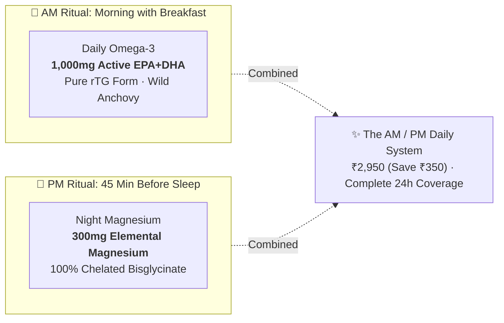
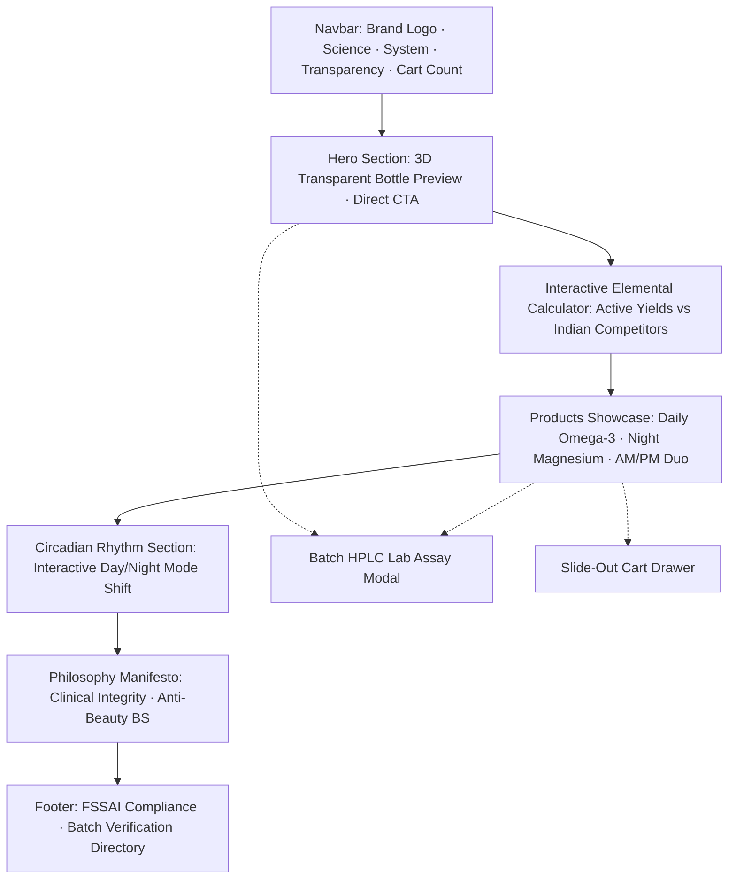

# Product Requirements Document (PRD): Staple Wellness
## Pre-Launch Foundation: D2C Web Platform, 2-SKU Architecture & Full Brand Kit

> **Document Status:** Pre-Launch Foundation (Pre-Production / v1.0)  
> **Brand:** Staple Wellness  
> **Benchmark & Global Inspiration:** Ritual.com (Clean clinical transparency, visible formulation, traceable ingredients)  
> **Target Market:** India (Urban Tier-1 Metros: Bengaluru, Mumbai, NCR, Hyderabad)  
> **Current Focus:** Exclusively **2 Hero SKUs** (Daily Omega-3 & Night Magnesium) + The AM/PM Daily System  
> **Author:** Product, Brand & Growth Engineering  
> **Target Launch Date:** Q4 2026 (Batch 01 VIP Access)  

---

## 1. Executive Summary & Brand Foundation

### 1.1 Brand Positioning: "The Ritual for India"
**Staple Wellness** is a science-first, clean-label nutraceutical brand engineered specifically for the Indian consumer. Inspired by the pioneering aesthetic simplicity, open-source ingredient traceability, and clinical honesty of **Ritual.com**, Staple Wellness is establishing the pre-launch foundation to redefine dietary supplementation in India.

> *"The science of feeling normal again."*  
> We are not a cosmetic beauty startup selling "glowing skin" gummies, nor an opaque pharmaceutical brand pushing synthetic megadoses. We are an honest, discerning peer delivering clinical transparency with an effortless daily routine.

### 1.2 The Pre-Launch Strategic Mandate: 2 SKUs Only
Rather than launching a bloated catalog of mediocre supplements, Staple Wellness adopts an obsessive, focused product strategy: **master the two foundational micronutrients that govern daily human biology:**
1. **Daytime Cellular Clarity & Cardiovascular Health:** Omega-3 in high-absorption rTG form.
2. **Nighttime Nervous System Down-Regulation & Deep Sleep:** Magnesium in 100% chelated Bisglycinate form.

By focusing strictly on **2 SKUs**, the brand achieves:
- **Capital Efficiency:** Highest inventory turns, concentrated raw material procurement, and zero product dilution.
- **Formulation Perfection:** No compromises on sourcing (Peruvian wild pelagic anchovies and pure chelated bisglycinate).
- **Clear Circadian Habit:** Seamless customer routine (AM pill for morning focus; PM pill for restful sleep).
- **Maximum Cart Economics:** The 2 SKUs naturally combine into the flagship **AM/PM Daily System**, generating high Average Order Value (AOV) from Day 1.

---

## 2. Market Problem & Whitespace in India

Based on comprehensive competitive teardowns of the Indian nutraceutical market (HK Vitals, Wellbeing Nutrition, Earthful, Ace Blend):

### 2.1 The Indian Omega-3 Problem (The "Ethyl Ester Trap")
- **Market Reality:** Over 80% of Omega-3 supplements sold on Amazon India and pharmacies use cheap, synthetic **Ethyl Ester (EE)** forms. Brands prominently advertise *"1,000mg Fish Oil"*, but a fine-print inspection reveals only 180mg EPA and 120mg DHA (a meager 300mg active yield).
- **The Staple Fix:** **1,000mg Active EPA+DHA** per serving in pure **re-esterified Triglyceride (rTG)** form—delivering **3.4x higher biological absorption** with cold-pressed Sicilian lemon oil to eliminate fish burps and acid reflux entirely.

### 2.2 The Indian Magnesium Problem (The "Oxide Laxative Scam")
- **Market Reality:** Drugstore magnesium tablets almost universally use **Magnesium Oxide**—an inexpensive compound with only **4% bioavailability** that primarily functions as an osmotic laxative rather than reaching neural receptors.
- **The Staple Fix:** **300mg Pure Elemental Magnesium** delivered exclusively through **100% Chelated Magnesium Bisglycinate** with **0mg Oxide fillers**. It binds to organic glycine to cross the blood-brain barrier intact and promote deep delta sleep without gastrointestinal distress.

### 2.3 The Whitespace: "High Elemental Potency + Radical Transparency"
> **No brand in India currently owns BOTH high active elemental potency AND radical, lot-by-lot transparency.** Staple Wellness is purpose-built to own this exact territory before expanding to any subsequent categories.

---

## 3. Product Portfolio: The 2 Core SKUs



### 3.1 SKU 1: Daily Omega-3 (`staple-omega3`)
- **Category:** Daytime Focus, Cellular Membrane Health & Cardiovascular Protection
- **Biochemical Form:** 100% Re-esterified Triglyceride (**rTG**)
- **Active Elemental Yield:** **1,000mg Active EPA+DHA** (600mg EPA / 400mg DHA per serving)
- **Provenance & Sourcing:** Wild-caught pelagic anchovies harvested from the pristine cold upwelling waters off Peru.
- **Aroma & Digestibility Technology:** Cold-pressed Sicilian lemon oil infusion tab inserted into the bottle neck. Zero fish burps, zero gastric reflux.
- **Physical Spec:** 60 pure golden amber softgels (30-day routine). Light-refracting, high-translucency gelatin shell.
- **Pricing:** **₹1,850** (30-day supply / 2 softgels daily).
- **Target Lot Spec:** `LOT-STP-2601-A` | HPLC active triglyceride yield: 99.4% | Heavy metals: Undetectable (<0.001 ppm) | TOTOX Oxidation: 4.2 (Ultra-fresh).

### 3.2 SKU 2: Night Magnesium (`staple-magnesium`)
- **Category:** Nighttime Nervous Down-Regulation, Muscle Recovery & Deep Delta Sleep
- **Biochemical Form:** 100% Pure Chelated **Magnesium Bisglycinate**
- **Active Elemental Yield:** **300mg Pure Elemental Magnesium** (Derived from fully reacted chelate)
- **Filler Declaration:** **Strictly 0mg Magnesium Oxide fillers.**
- **Mechanism of Action:** Utilizes dipeptide glycine transport channels to cross the intestinal wall and blood-brain barrier without competing with other minerals or causing laxative side effects.
- **Physical Spec:** 60 pure matte white vegetarian capsules (30-day routine). Clean plant cellulose shell.
- **Pricing:** **₹1,450** (30-day supply / 2 capsules 45 mins before sleep).
- **Target Lot Spec:** `LOT-STP-2602-B` | HPLC chelation assay: 99.8% | Heavy metals: Undetectable (<0.001 ppm) | FSSAI Lic. #10023043000892.

### 3.3 Flagship Routine: The AM/PM Daily System (`staple-duo-bundle`)
- **Description:** Complete 24-hour biological protocol (Brain by Day, Nervous Recovery by Night).
- **Includes:** 1x Daily Omega-3 + 1x Night Magnesium (Full 30-day routine).
- **Pricing:** **₹2,950** (Save ₹350 vs ₹3,300 single-bottle sum).
- **Strategic Purpose:** Designed as the primary purchase hook across all marketing, driving early Average Order Value (AOV) > ₹2,900.

### 3.4 Out-of-Scope SKUs (Strictly Post-Launch / v2)
- ❌ Synbiotic / Gut Health: Formulation locked in pipeline; zero development or marketing bandwidth allocated prior to v1 launch.
- ❌ Vitamin D3/K2, Multivitamins, Nootropics: Excluded from Phase 1.

---

## 4. Brand Foundation & Marketing Kit

### 4.1 Visual Identity: Ritual-Inspired Palette (Enhanced for India)
*Reference: [`Doc/design.md`](file:///c:/Users/hp/Documents/staple_wellness/Doc/design.md)*

Inspired directly by Ritual.com's clean sunshine transparency and high-contrast editorial typography, enhanced with warm solar-gold and royal indigo tones that resonate deeply with Indian health aesthetics (*Surya* vitality to *Chandra* restorative stillness).

| Color Token | Hex Code | Ritual Benchmark | Indian Market Enhancement & Role |
| :--- | :--- | :--- | :--- |
| **Solar Marigold Gold** | `#F5B731` | *Ritual Yellow* | Rich golden-amber sun tone. Represents pure rTG oil and life force. Signature brand CTA accent and label ribbon. |
| **Imperial Midnight Indigo** | `#0C1D2E` | *Ritual Navy* | Deep oceanic Indian midnight ink with sapphire undertones. High authority typography, primary buttons, linework. |
| **Sandalwood Milk Canvas** | `#FAF8F5` | *Ritual Milk* | Luminous warm ivory canvas. Glare-free under bright Indian daylight and mobile OLED screens. |
| **Oat Surface** | `#F3EFE6` | *Ritual Cream* | Elevated cards, HUD calculator panels, pill containers, subtle dividers. |
| **Crisp Laboratory White** | `#FFFFFF` | *Pure White* | Product cards and floating visualizer containers for clinical purity contrast. |
| **Chandra Midnight** | `#130E20` | *Night Mode* | Deep lunar violet canvas for Magnesium sleep ritual (nervous down-regulation). |
| **Pure Amber Pill** | `#D97706` | *Amber Softgel* | Optical refraction hue of Peruvian wild anchovy rTG softgel. |

### 4.2 Typography Hierarchy
- **Editorial & Headlines:** `Plus Jakarta Sans` or `Satoshi` (Semibold/Bold, tight letter tracking `tracking-tight`). Expresses warmth, approachability, and discernment.
- **Technical HUD & Clinical Specs:** `JetBrains Mono` or `Space Mono` (Uppercase, micro-copy `text-xs`/`text-sm`, wide tracking `tracking-widest`). Used exclusively for active yields (`1,000MG ACTIVE EPA+DHA`), lot codes (`LOT-STP-2601-A`), and HPLC assay metrics.

### 4.3 Physical Packaging Guidelines (Ritual-Inspired)
- **Transparent Bottle Architecture:** Custom cylindrical ultra-clear glass/PET bottle (`transmission: 0.95`, `roughness: 0.05`). The pills inside must remain completely visible to demonstrate purity.
- **The 50% Half-Wrap Label:** Matte-finish Sandalwood Cream (`#F5EFE0`) label with Solar Marigold Gold (`#F5B731`) vertical accent covering only 50% of the bottle circumference. Minimalist typography in Midnight Indigo (`#0C1D2E`).
- **Tactile Pills:**
  - *Omega-3:* Translucent, light-refracting golden amber softgel that catches sunlight.
  - *Magnesium:* Matte chalk-white vegetarian capsule with organic surface texture.
- **Aroma Tab:** Food-grade Sicilian lemon citrus tab embedded into the cap foil.

### 4.4 Brand Voice & Copywriting Rules ("The Honest Peer")
- **Be Direct & Biological:** Focus on the tangible physiological outcome ("Sharp afternoon focus, zero acid reflux").
- **Radical Ingredient Honesty:** Explain the biochemical *why* without apology ("We use rTG because your body actually absorbs it; we charge more because the raw materials cost 4x more").
- **Banned Words:**
  - ❌ No pharma jargon: *posology, therapeutic indication, supplementation protocol*.
  - ❌ No fear-mongering: *silent killer, failing immunity, toxic body*.
  - ❌ No beauty clichés: *glow, radiance, miracle, detox, anti-aging*.
  - ❌ No fake discounts: Never use crossed-out artificial MRPs (*~₹2,999~ ₹1,850*).

---

## 5. D2C Digital Experience & Web Store Specs

The web application is built on **React 19 + Vite** with a modular component architecture already initialized in [`src/`](file:///c:/Users/hp/Documents/staple_wellness/src/).

### 5.1 Landing Page Architecture (Current Implementation)



#### FR-01: Hero & 3D Pill Interaction
- **Files:** [`src/components/Hero.jsx`](file:///c:/Users/hp/Documents/staple_wellness/src/components/Hero.jsx), [`src/components/Canvas3D.jsx`](file:///c:/Users/hp/Documents/staple_wellness/src/components/Canvas3D.jsx), [`src/components/BottleVisual.jsx`](file:///c:/Users/hp/Documents/staple_wellness/src/components/BottleVisual.jsx)
- **Requirements:**
  - Cinematic ambient lighting with floating softgel and capsule visualizer.
  - Quick action buttons: "Order AM/PM System" and "Inspect Lab Assay".
  - Key trust badges: FSSAI Certified, 100% Traceable Origin, Zero Fish Burps Guarantee.

#### FR-02: Interactive Elemental Potency Calculator
- **Files:** [`src/components/ElementalCalculator.jsx`](file:///c:/Users/hp/Documents/staple_wellness/src/components/ElementalCalculator.jsx)
- **Requirements:**
  - Dynamic comparison slider showing true active elemental milligrams vs gross compound weight.
  - Highlights the 3.4x absorption advantage of rTG vs synthetic Ethyl Ester.
  - Demonstrates how Magnesium Oxide's 4% absorption wastes customer money.

#### FR-03: 2-SKU + Duo Bundle Product Cards
- **Files:** [`src/components/Products.jsx`](file:///c:/Users/hp/Documents/staple_wellness/src/components/Products.jsx), [`src/data/products.js`](file:///c:/Users/hp/Documents/staple_wellness/src/data/products.js)
- **Requirements:**
  - Individual cards for Daily Omega-3 and Night Magnesium with full technical spec chips (elemental yield, chelated form, source, digestibility).
  - Prominent hero feature card for **The AM/PM Daily System** (₹2,950 with ₹350 instant bundle savings).
  - One-click "Add to Routine" and "View HPLC Assay" modal triggers.

#### FR-04: Circadian Day-to-Night UI Shift
- **Files:** [`src/components/CircadianSection.jsx`](file:///c:/Users/hp/Documents/staple_wellness/src/components/CircadianSection.jsx), [`src/App.jsx`](file:///c:/Users/hp/Documents/staple_wellness/src/App.jsx)
- **Requirements:**
  - Smooth visual theme transition to Deep Plum (`#2D1B2E`) to reflect the nervous down-regulation of Night Magnesium.
  - Explains the neuroscience of glycine crossing the blood-brain barrier for restorative REM and slow-wave delta sleep.

#### FR-05: Radical Transparency HPLC Certificate Modal
- **Files:** [`src/components/TransparencyModal.jsx`](file:///c:/Users/hp/Documents/staple_wellness/src/components/TransparencyModal.jsx)
- **Requirements:**
  - Interactive lot search for `LOT-STP-2601-A` and `LOT-STP-2602-B`.
  - Detailed verification: HPLC purity assay, heavy metal screening (Lead, Cadmium, Mercury undetectable <0.001 ppm), TOTOX oxidation score, and verifiable FSSAI manufacturing license.

#### FR-06: Frictionless Cart Drawer & Early Access Pre-Order State
- **Files:** [`src/components/CartDrawer.jsx`](file:///c:/Users/hp/Documents/staple_wellness/src/components/CartDrawer.jsx)
- **Requirements:**
  - Slide-out cart drawer with dynamic subtotal and bundle upgrade recommendations.
  - Support for pre-launch **Batch 01 Early Access Reservation** (capturing phone number, email, and VIP reserve status before commercial checkout goes live).

---

## 6. Pre-Launch Readiness & Foundation Checklist

Before commercial launch, the brand foundation must satisfy the following five readiness gates:

```
[ ] GATE 1: Physical Sourcing & Lab Verification
    ├── Finalized supplier Certificate of Analysis for Peruvian rTG Omega-3
    ├── Finalized supplier Certificate of Analysis for Pure Chelated Magnesium Bisglycinate
    ├── Third-party Indian laboratory HPLC assays completed
    └── Heavy metals and TOTOX oxidation reports signed off

[ ] GATE 2: Packaging & Manufacturing
    ├── Custom ultra-clear bottles produced and quality-checked
    ├── Half-wrap matte labels printed with mandatory FSSAI declarations
    ├── Cold-pressed Sicilian lemon aroma tab integrated into cap
    └── Pilot run of 500 units per SKU manufactured under GMP standards

[ ] GATE 3: Digital Platform & Conversion Architecture
    ├── Production deployment of React + Vite frontend on high-speed CDN
    ├── Core Web Vitals validated (LCP < 1.2s, Mobile responsiveness 100%)
    ├── Razorpay / Cashfree UPI 1-click checkout sandbox tested
    └── WhatsApp transactional alert integration (Order confirmation & tracking)

[ ] GATE 4: Legal & Regulatory
    ├── FSSAI Central License active and printed on packaging
    ├── Mandatory nutritional labeling values verified against Indian RDA standards
    └── Privacy Policy and Terms compliant with the Indian DPDP Act 2023

[ ] GATE 5: Pre-Launch Marketing & Community Seeding
    ├── VIP Early Access Waitlist active on the website (Batch 01 allocation)
    ├── Founder-led educational videos recorded (The "Fish Burp" and "Magnesium Oxide" teardowns)
    └── Seeding kits sent to 50 targeted medical doctors, biohackers, and fitness coaches
```

---

## 7. Performance Ad Angles & Objection Handlers (Pre-Launch Seeding)

| Ad Angle | The Hook | Educational Core | Primary Objection Handled |
| :--- | :--- | :--- | :--- |
| **"The Fish Burp Lie"** | *"Why cheap fish oil tastes like dead fish."* | Explains that fish burps are caused by rancid, oxidized Ethyl Ester oil. Contrasts with Staple's fresh rTG form and Sicilian lemon infusion. | *"I don't take Omega-3 because I can't stand the fishy aftertaste."* |
| **"The Laxative Scam"** | *"Check the back of your Magnesium bottle right now."* | Teardown of Magnesium Oxide: 4% absorption, acts as an osmotic laxative. Demonstrates why 100% Bisglycinate is required for sleep. | *"Magnesium gave me loose motions and didn't help me sleep."* |
| **"The Label Math"** | *"1,000mg Fish Oil ≠ 1,000mg Omega-3."* | Educates the consumer on active elemental yields vs gross compound weights disguised by Indian brands. | *"Why is Staple ₹1,850 when drugstore brands are ₹600?"* |

---

## 8. Launch Milestones & Roadmap

| Milestone | Scope | Target Window | Deliverables |
| :--- | :--- | :--- | :--- |
| **Phase 1: Brand & Digital Foundation** | Core Brand System & Web Flagship | Current | Finalized PRD, design tokens, 3D assets, interactive landing page, calculator, and HPLC modal. |
| **Phase 2: VIP Waitlist & Batch 01 Seeding** | Pre-Launch Early Access | Month 1–2 | Launch waitlist on D2C page; seed 50 influencer/doctor kits; collect initial testimonials and feedback. |
| **Phase 3: Commercial D2C Go-Live** | Public Storefront Launch | Month 3 | Open public checkout for Daily Omega-3, Night Magnesium, and AM/PM Duo Bundle via 1-click UPI/Razorpay. |
| **Phase 4: Marketplace & Retention** | Channel Expansion | Month 4–6 | Amazon India Brand Store; WhatsApp 30-day automated replenishment; subscription AutoPay onboarding. |

---

## 9. Appendix: Project References

- **Brand Design System & Color Palette:** [`Lending_page.md`](file:///c:/Users/hp/Documents/staple_wellness/Lending_page.md)
- **Indian Market Competitor Intelligence:** [`reports_&_market-data/Market_Research.md`](file:///c:/Users/hp/Documents/staple_wellness/reports_&_market-data/Market_Research.md)
- **6-Brand Indian Nutraceutical Teardown:** [`reports_&_market-data/indian_nutraceutical_teardown.md`](file:///c:/Users/hp/Documents/staple_wellness/reports_&_market-data/indian_nutraceutical_teardown.md)
- **Active SKU Definitions & HPLC Assay Mock Data:** [`src/data/products.js`](file:///c:/Users/hp/Documents/staple_wellness/src/data/products.js)
- **React Frontend Application Entrypoint:** [`src/App.jsx`](file:///c:/Users/hp/Documents/staple_wellness/src/App.jsx)
