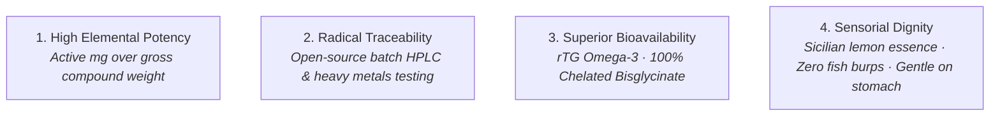

# Brand Guidelines & Identity Bible: Staple Wellness
## The Clinical Transparency Standard for Indian Wellness

> **Document:** Brand Identity System (`brand.md`)  
> **Brand Name:** Staple Wellness  
> **Core Motto:** *"The science of feeling normal again."*  
> **Brand Positioning:** Clinical transparency meets effortless daily routine.  
> **Benchmark & Global Peer:** Inspired by the aesthetic clarity and open-source traceability of **Ritual.com**, re-engineered for the Indian consumer.  
> **Current Focus:** Pre-Launch Foundation · 2 Core SKUs (Daily Omega-3 & Night Magnesium) + The AM/PM Daily System.  

---

## 1. Brand Essence & Manifesto

### 1.1 Who We Are
Staple Wellness is an institutional-grade, clean-label nutraceutical brand. We exist because the Indian dietary supplement market is broken: flooded with opaque chemical compounds, cheap synthetic fillers, and misleading marketing banners that disguise sub-therapeutic active doses behind large gross compound weights.

We believe that high-potency nutritional supplementation is not a luxury or a cosmetic experiment—it is the biological foundation for modern human performance.

### 1.2 The Brand Manifesto
> *"We read the fine print so you don’t have to."*
> 
> Most supplements on Indian shelves rely on an unspoken truth: you won't check the chemistry. They sell '1,000mg Fish Oil' that yields only 300mg of usable fatty acids in synthetic forms your liver struggles to process. They sell 'Magnesium' that is 96% laxative oxide filler.
> 
> We reject the beauty industry's empty promises of 'instant glow' and the pharmaceutical industry's cold, intimidating jargon. We formulate with the exact biochemical forms your cells recognize—at clinical dosages, with open-source batch testing, wrapped in an effortless morning-and-night habit.
> 
> Welcome to radical biological honesty.

---

## 2. Brand Archetype & Persona

| Attribute | Definition | Practical Manifestation |
| :--- | :--- | :--- |
| **Primary Archetype** | **The Sage** (Scientific rigor, truth-seeking) | Every product page links directly to peer-reviewed PubMed studies and lot-specific HPLC assays. |
| **Secondary Archetype** | **The Discerning Peer** (Honest, approachable friend) | We speak like an educated colleague at coffee who knows biochemistry—calm, confident, and never patronizing. |
| **Who We Are NOT** | ❌ The Vanity Brand | We don't sell vanity, glowing skin gummies, or magical detox cleanses. |
| **Who We Are NOT** | ❌ The Alarmist Pharma Label | We never use fear-mongering ("silent killers") or clinical intimidation. |

---

## 3. The Four Brand Pillars (Non-Negotiables)



1. **High Active Elemental Potency:** We never advertise gross oil weight. We declare the exact bioavailable milligram yield on the front of the bottle (1,000mg Active EPA+DHA; 300mg Pure Elemental Magnesium).
2. **Radical Traceability:** Every customer can inspect the exact third-party laboratory Certificate of Analysis (CoA) for their specific bottle lot code—including heavy metals (Lead, Cadmium, Mercury < 0.001 ppm) and TOTOX oxidation values.
3. **Superior Bioavailability:** We only use physiological forms that match human cell receptors. We use re-esterified Triglyceride (rTG) for Omega-3 (3.4x greater absorption than drugstore Ethyl Ester) and 100% chelated Magnesium Bisglycinate (0mg Oxide fillers).
4. **Sensorial Dignity:** Supplements must feel pleasant to take every day. Our Omega-3 bottles include cold-pressed Sicilian lemon oil infusion tabs to eliminate reflux and fish burps. Our Magnesium is bound to organic glycine to prevent gastrointestinal upset.

---

## 4. Voice, Tone & Copywriting Rules

### 4.1 Tone Principles
- **Direct & Biological:** Connect the ingredient directly to bodily sensation ("Clean afternoon mental clarity, zero fishy aftertaste").
- **Intellectually Honest:** Explain the *why* transparently. If our price is higher, we state the raw material cost disparity with complete confidence.
- **Calm & Measured:** No shouting, no exclamation points, no frantic urgency countdown timers.

### 4.2 The "Ritual for India" Copywriting Playbook

| Scenario | ❌ What Competitors Say (Banned) | ✅ How Staple Wellness Speaks |
| :--- | :--- | :--- |
| **Omega-3 Potency** | *"Double strength 1,000mg pure deep-sea salmon oil for glowing health!"* | *"1,000mg Active EPA+DHA in natural rTG form. Harvested from Peruvian pelagic anchovies with 3.4x cellular absorption."* |
| **Magnesium & Sleep** | *"Miracle sleep tablet! Knock out stress and cure insomnia tonight!"* | *"300mg pure elemental magnesium chelated with glycine. Crosses the blood-brain barrier to down-regulate your central nervous system for delta-wave sleep."* |
| **Pricing & Value** | *"Massive 60% OFF! ~~₹2,999~~ Only ₹999 for today only!"* | *"₹1,850 for a 30-day routine. We charge a fair premium because wild-caught rTG oil costs 4x more than generic Ethyl Ester."* |
| **Fillers & Purity** | *"100% natural, ayurvedic herbal booster with zero side effects."* | *"Zero Magnesium Oxide. Undetectable heavy metals (<0.001 ppm). Every batch verified by independent HPLC chromatography."* |

### 4.3 Explicitly Banned Vocabulary
- **Pharma Jargon:** *posology, therapeutic indication, pharmacokinetics, synthetic megadose*.
- **Alarmist Fear Hooks:** *silent killer, failing organs, toxic overload, disease risk*.
- **Beauty/Wellness Clichés:** *miracle glow, detox, anti-aging secret, radiant skin, magic elixir*.
- **Artificial Marketing Gimmicks:** *flash sale, hurry limited stock, fake crossed-out MRPs*.

---

## 5. Physical Packaging & Product Identity (Ritual-Inspired)

```
        ┌─────────────────────────┐
        │   BOTTLE ARCHITECTURE   │
        └────────────┬────────────┘
                     │
    ┌────────────────┴────────────────┐
    ▼                                 ▼
[ ULTRA-CLEAR BOTTLE ]       [ 50% HALF-WRAP LABEL ]
• 100% visible contents      • Matte Dawn Plaster (#F2D4D4)
• High-refraction PET/Glass  • Obsidian Slate Ink typography
• Lemon aroma tab in cap     • 180° window exposes pills
```

### 5.1 Bottle Construction
- **Material:** Ultra-transparent, high-refraction pharmaceutical-grade PET or recycled glass (`transmission: 0.95`, `roughness: 0.05`).
- **Visibility Principle:** The customer must see the physical pills inside from across the room. Visibility is our proof of purity.
- **Aroma Tab:** A food-grade citrus disc infused with cold-pressed Sicilian lemon oil is embedded in the cap seal to keep the interior bottle atmosphere fresh and pleasant.

### 5.2 The 50% Half-Wrap Label
- **Coverage:** The label wraps exactly 180 degrees (50%) around the bottle circumference.
- **Label Substrate:** Matte tactile uncoated paper finish in **Warm Sandalwood Cream (`#F5EFE0`)** with a distinctive **Solar Marigold Gold (`#F5B731`)** vertical brand accent.
- **Front Panel:** Brand wordmark, SKU title, Active Elemental Yield in monospace bracket notation (`[ 1,000MG ACTIVE EPA+DHA ]`), and routine timing in Imperial Midnight Indigo (`#0C1D2E`).
- **Exposed Rear Window:** The clear rear wall allows ambient light to pass directly through the amber softgels or white capsules.

### 5.3 Pill Aesthetics
- **Daily Omega-3 Softgels:** High-clarity, translucent golden amber softgel. When light passes through, it emits a warm amber glow (`rgba(217, 119, 6, 0.4)`).
- **Night Magnesium Capsules:** Pure matte chalk-white vegetarian capsule (Size 00) with subtle organic texture.

---

## 6. Visual Identity Spectrum: Ritual-Inspired (Enhanced for India)

The visual universe is directly inspired by **Ritual.com's** iconic sunshine transparency and high-contrast editorial typography, enhanced with warm golden-amber and deep indigo tones that resonate deeply with Indian health philosophy (*Surya* daylight vitality to *Chandra* lunar stillness):

- **Solar Marigold Gold (`#F5B731`):** Replaces cold Western lemon yellow with a rich, auspicious golden-amber hue. Represents pure rTG oil, sunshine vitality, and premium distinction.
- **Imperial Midnight Indigo (`#0C1D2E`):** Deep oceanic Indian midnight ink with sapphire undertones. Provides 15.8:1 AAA contrast and clinical authority.
- **Sandalwood Milk Canvas (`#FAF8F5`):** Soft, warm ivory background that avoids harsh digital glare.
- **Warm Oat Surface (`#F3EFE6`):** Secondary cards, HUD trays, and technical spec containers.
- **Circadian Chandra Night (`#130E20` & `#1F1733`):** Deep lunar midnight violet for the Magnesium sleep ritual.

---

## 7. Pre-Launch Foundation Directives

During the current pre-launch phase, all brand initiatives must strictly serve the **2 core SKUs**:
1. **Focus:** Lock down the visual, physical, and digital consistency for Daily Omega-3 and Night Magnesium.
2. **Authority:** Establish credibility by publicly releasing HPLC test assays and founder-led formulation teardowns.
3. **Restraint:** Reject all category expansion requests (gummies, synbiotics, multivitamins) until the 2-SKU AM/PM habit is firmly established in Tier-1 Indian metros.
